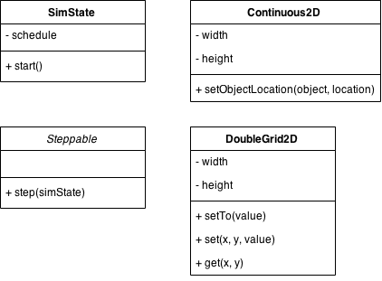
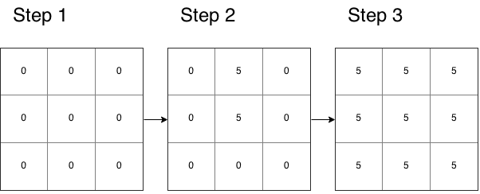

MASON
=====

**MASON** (*m*ulti*a*gent *s*imulation *o*f *n*etworks) ist ein Java Toolkit, um Simulationen zu erstellen.

MASON...

-	...definiert Zeit als Zeitschritt (Steps).
-	...ist unabhängig von einer Domäne.
	-	Agenten können frei definiert werden.
	-	In unserem Fall bspw. Nodes.
-	...übernimmt die Diskretisierung von Räumen und Flächen.
	-	Agenten können auf Flächen oder in Räumen angeordnet werden.
	-	Abstände zwischen Agent und Nachbarn können automatisch berechnet werden.
-	...trennt strikt zwischen Ausführung und Visualisierung.

---

MASON Konzepte
==============




-	`SimState` (abstrakte Klasse) beschreibt eine Simulation.
-	`Continous2D` beschreibt ein discretisierte Fläche.
-	`Steppable` representiert Agenten.
-	`DoubleGrid2D` beschreibt Fläche, deren einzelne Punkte Werte haben

---

SimState
========

Eine Simulation erbt von `SimState` und überschreibt typischerweiße die `start()` Methode. In `start()` werden Agenten angelegt und mit Hilfe des `schedule` gezeited werden. `schedule.scheduleRepeating()` sorgt bspw. dafür, dass der Agent in jedem Zeitschritt (Step) ausgeführt wird.

```java
public class Simulation {
  public void start() {
      super.start();
      Agent agent = new Agent(1);
      schedule.scheduleRepeating(agent);
  }
}
```

Dadurch kann sie einfach mit Hilfe der `doLoop` Methode gestarted werden:

```java
public static void main(String[] args) {
    doLoop(Students.class, args);
    System.exit(0);
}
```

---

Steppable
=========

Ein Agent implementiert das implementiert das Interface `Steppable`. Die Methode `step(state)` definiert was ein Agent in einem Schritt durchführen soll. Der Paramater `simState` ist die Simulation von der aus der Agent ausgeführt wird.

```java
public class Agent implements Steppable {

    private int id;

    public Agent(int id) {

        this.id = id;
    }

    @Override
    public void step(SimState simState) {
        Simulation simulation = (Simulation)simState;
        long step = simulation.schedule.getSteps();

        System.out.println(step + " Agent" + id + " executed");
    }
}
```

---

Continous2D
===========

`Continous2D` Objekte representieren diskretisierte Flächen, auf den Agenten (`Steppables`) angeordnet werden können. Typischerweiße werden diese in `Simulation.start()` angelegt. Die Methode `setObjectLocation(steppable, double2d)` definiert den Ort eines Agenten.

**Beispiel**:


---

Continous2D
===========

```java
public class Simulation extends SimState {
    // ...
    private Continuous2D area = new Continuous2D(1, 3, 3);

    public void start() {
        super.start();

        Agent agent1 = new Agent(1);
        area.setObjectLocation(agent1, new Double2D(0, 0));

        Agent agent2 = new Agent(2);
        area.setObjectLocation(agent2, new Double2D(2, 1));

        schedule.scheduleRepeating(agent1);
        schedule.scheduleRepeating(agent2);
    }
    // ...
}
```

---

DoubleGrid2D
============

Ein `DoubleGrid2D` Objekt ist eine Fläche, deren Punkte Werte haben.

-	`setTo(value)` vergibt an alle Punkte den Wert `value`.
-	`set(x, y, value)` vergibt an den Punkt (x, y) den Wert `value`.
-	`get(x, y)` gibt den Wert am Punkt (x, y) zurück.

**Beispiel**:



---

DoubleGrid2D
============

```java
public class GridAgent implements Steppable {

    private DoubleGrid2D grid = new DoubleGrid2D(3, 3);

    @Override
    public void step(SimState simState) {
        Simulation simulation = (Simulation)simState;
        long step = simulation.schedule.getSteps();

        if(step == 1) {
            grid.setTo(0);
        }

        if(step == 2) {
            grid.set(1, 1, 5);
            grid.set(1, 2, 5);
        }

        if(step == 3) {
            grid.setTo(5);
        }
    }

    public double getValue(int x, int y) {
        return grid.get(x, y);
    }
}
```

---

AHSN Simulator
==============

Der **A**d-**H**oc und **S**ensor **N**etworke Simulator basiert auf MASON.

-	`AHSNSimulationWithoutUI` ist die Simulation/`SimState`
-	`AHSNNode`, `Network`, `Application` sind Agents/`Steppables`
-	Die Simulation enthält ein `Continous2D` `area` auf dem die `AHSNNode` angeordnet sind

**Neu**:

-	`AHSNSyncNode` ist ein spezieller `AHSNNode` der den *SyncNode* representiert. Dieser kann eigens über `Configuration.SyncNodeMoving` als beweglich markiert.
-	`Forest` ist ein Agent/`Steppable` der ein `DoubleGrid2D` `grid` enthält und ein Wald representiert.
-	Aktueller Zustand Wald, fängt bei 1000 Schritten komplette an zu brennen

---

Aufgabe
=======

Kontrolliertes Feuer:

-	zu jedem 1000 zeitpunkt bricht an einer random Stelle ein Feuer aus
-	in den nachfolgenden Schritten breitet sich das Feuer auf die Nachbarn aus (in jedem 50?)

AHSNNode:

-	Knoten sollen Temperatur messen
	-	`getLocation` gibt die aktuelle Location zurück
	-	wenn Sie Feuer (Temperatur > 30) entdecken sollen sie exakt eine Broadcast schicken

SinkNode:

-	Einzelner Logger, von welchem Knoten + Latenz

Auswertung:

-	Laufzeit 15 000
-	Latenz
