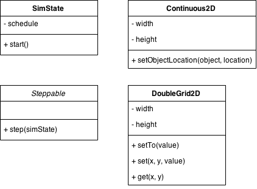
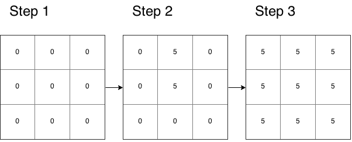

# Ad-hoc und Sensornetze - Übung 4


**Sarah Edenhofer**


Sommersemester 2015

02.06.2015

---

# Besprechung Übungsblatt 3


---

# AHSN-Simulator


- **Server**: http://oc-appsrv01.informatik.uni-augsburg.de/svn/ahsn-simulator-students/
- **Zugangsdaten**:
  - Benutzername: *ahsn-student*
  - Passwort: *ahsn2015*

---

# MASON


**MASON** (**M**ulti**a**gent **S**imulation **o**f **N**etworks) ist ein Java Toolkit, um Simulationen zu erstellen.

MASON...

-	...definiert Zeit als Zeitschritte (*Steps*).
-	...ist unabhängig von einer Domäne:
	-	Agenten können frei definiert werden.
	-	In unserem Fall bspw. Nodes.
-	...übernimmt die Diskretisierung von Räumen und Flächen.
	-	Agenten können auf Flächen oder in Räumen angeordnet werden.
	-	Abstände zwischen Agent und Nachbarn können automatisch berechnet werden.
-	...trennt strikt zwischen Ausführung und Visualisierung.

---

# MASON Konzepte





-	`SimState` (abstrakte Klasse) beschreibt eine Simulation.
-	`Continous2D` beschreibt ein diskretisierte Fläche zur Anordnung der Agenten.
-	`Steppable` (Interface) repräsentiert Agenten.
-	`DoubleGrid2D` beschreibt Fläche, deren einzelne Punkte Werte haben

---

SimState
========

Eine Simulation erbt von `SimState` und überschreibt typischerweise die `start()`-Methode. In `start()` werden Agenten angelegt und mit Hilfe des `schedule` "gezeited". `schedule.scheduleRepeating()` sorgt bspw. dafür, dass der Agent in jedem Zeitschritt (Step) ausgeführt wird.

```java
public class Simulation extends SimState {
  public void start() {
      super.start();
      Agent agent = new Agent(1);
      schedule.scheduleRepeating(agent);
  }
}
```

Dadurch kann sie einfach mit Hilfe der `doLoop` Methode gestartet werden:

```java
public static void main(String[] args) {
    doLoop(Simulation.class, args);
    System.exit(0);
}
```


---

Steppable
=========

Ein Agent implementiert das Interface `Steppable`. Die Methode `step(simState)` definiert, was ein Agent in einem Schritt durchführen soll. Der Paramater `simState` ist die Simulation, von der aus der Agent ausgeführt wird.

```java
public class Agent implements Steppable {

    private int id;

    public Agent(int id) {

        this.id = id;
    }

    @Override
    public void step(SimState simState) {
        Simulation simulation = (Simulation)simState;
        long step = simulation.schedule.getSteps();

        System.out.println(step + " Agent" + id + " executed");
    }
}
```

---

Continous2D
===========

`Continous2D` Objekte repräsentieren diskretisierte Flächen, auf denen Agenten (`Steppables`) angeordnet werden können. Typischerweiße werden diese in `Simulation.start()` angelegt. Die Methode `setObjectLocation(steppable, double2d)` definiert den Ort eines Agenten.

**Beispiel**:


---

Continous2D
===========

```java
public class Simulation extends SimState {
    // ...
    private Continuous2D area = new Continuous2D(1, 3, 3);

    public void start() {
        super.start();

        Agent agent1 = new Agent(1);
        area.setObjectLocation(agent1, new Double2D(0, 0));

        Agent agent2 = new Agent(2);
        area.setObjectLocation(agent2, new Double2D(2, 1));

        schedule.scheduleRepeating(agent1);
        schedule.scheduleRepeating(agent2);
    }
    // ...
}
```

---

DoubleGrid2D
============

Ein `DoubleGrid2D` Objekt ist eine Fläche, deren Punkte Werte haben.

-	`setTo(value)` vergibt an alle Punkte den Wert `value`, z.B. `setTo(0)`
-	`set(x, y, value)` vergibt an den Punkt (x, y) den Wert `value`, z.B. `setTo(0, 1, 5)`
-	`get(x, y)` gibt den Wert am Punkt (x, y) zurück, z.B. `get(0, 1)` liefert `5`.

**Beispiel**:



---

DoubleGrid2D
============

```java
public class GridAgent implements Steppable {

    private DoubleGrid2D grid = new DoubleGrid2D(3, 3);

    @Override
    public void step(SimState simState) {
        Simulation simulation = (Simulation)simState;
        long step = simulation.schedule.getSteps();

        if(step == 1) {
            grid.setTo(0);
        }

        if(step == 2) {
            grid.set(0, 1, 5);
            grid.set(1, 1, 5);
        }

        if(step == 3) {
            grid.setTo(5);
        }
    }

    public double getValue(int x, int y) {
        return grid.get(x, y);
    }
}
```

---

AHSN Simulator
==============

Der **A**d-**H**oc and **S**ensor **N**etworks Simulator basiert auf MASON.

-	`AHSNSimulationWithoutUI` ist die Simulation/`SimState`
-	`AHSNNode`, `Network`, `Application` sind Agents/`Steppables`
-	Die Simulation enthält ein `Continous2D` `area`, auf dem die `AHSNNodes` angeordnet sind

**Neu**:

-	`AHSNSinkNode` ist ein spezieller `AHSNNode`. Dieser kann eigens über `Configuration.getSinkNodeSpeed()` als beweglich markiert werden.
-	`Forest` ist ein Agent/`Steppable`, der ein `DoubleGrid2D` `grid` enthält und einen Wald repräsentiert.


---

4. Übungsblatt - Aufgabe 1
==========================

**Kontrolliertes Feuer**:

Implementieren Sie in Klasse `simulation.Forest`:

- Zu jedem 1000. Zeitpunkt/Step bricht an einer zufälligen Stelle (benutzen Sie hierzu `getNewRandomInitial(SimState simState)`) ein Feuer aus. Feuer bedeutet, die Temperatur wird auf `Configuration.getMaxTemperature()` gesetzt. 
- Fängt ein neues Feuer an zu brennen, wird das alte gelöscht.
- In jedem 200. nachfolgenden Schritt breitet sich das Feuer auf den jeweils linken, rechten, oberen und unteren Nachbarn aus.


---

4. Übungsblatt - Aufgabe 2
==========================

**Temperaturmessung**

Bauen Sie in der Klasse `node.AHSNNode` eine Temperaturmessung ein. Hierzu soll die Klasse `monitorTemperature()` Temperaturveränderungen überwachen und im Falle eines neuen Feuers einen Broadcast senden.
  

---

4. Übungsblatt - Aufgabe 3
==========================

**Logging III**

- Der `AHSNSinkNode` soll bei Empfang eines Broadcast unter anderem die Temperatur, den Absender und den Messort loggen.
- Werten Sie die unterschiedliche Latenz aus, wenn der `AHSNSinkNode` die ID 0, 5 oder 14 hat. Die `SinkNodeID` kann in der `Configuration` gesetzt werden.
- Für jede Auswertung sollen 50.000 Zeitschritte (entspricht 50 mal Feuer) betrachtet werden.
  

---


4. Übungsblatt
==============

- Abgabe bis 14.06.2015
- Abgabe per e-Mail an [sarah.edenhofer@informatik.uni-augsburg.de](mailto:sarah.edenhofer@informatik.uni-augsburg.de "sarah.edenhofer@informatik.uni-augsburg.de")
- Abzugeben: 
  - Code 
  - Log-Files
  - Auswertung
  
---
 

Kontakt
=======

M. Sc. Sarah Edenhofer 

E-Mail: [sarah.edenhofer@informatik.uni-augsburg.de](mailto:sarah.edenhofer@informatik.uni-augsburg.de)

Raum: 509


Dr. - Ing. Sven Tomforde

E-Mail: [sven.tomforde@informatik.uni-augsburg.de](mailto:sven.tomforde@informatik.uni-augsburg.de)

Raum: 503


Adresse: Eichleitnerstr. 30, 86159 Augsburg, Germany


