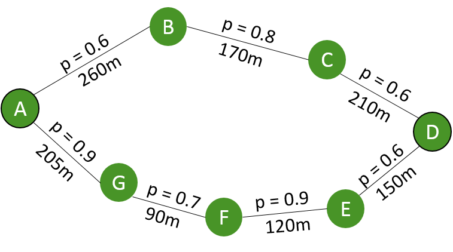

# Ad-hoc und Sensornetze - Übung 6

**Sarah Edenhofer**

Sommersemester 2015

23.06.2015

---
Arbeit zu vergeben!
==================

**Themenstellung**

- Recherche aktueller Technologien zur ad-hoc Kommunikation
- Recherche verfügbarer Implementierungen (Funkmodule)
- Erstellen eines Kriterienkatalogs zu Auswahl
- Aufbau eines Testbeds mit mehreren Knoten (z.B. basierend auf Raspberry Pi + Funkmodul)
- Implementierung/Portierung ausgewählter ad-hoc Protokolle
- Durchführung einer Leistungsbewertung der ausgewählten ad-hoc Protokolle

Mögliches Format: **Praxismodul, Forschungsmodul** (je nach Schwerpunkt)

Kontakt: Prof. Jörg Hähner ([joerg.haehner@informatik.uni-augsburg.de](mailto:joerg.haehner@informatik.uni-augsburg.de "joerg.haehner@informatik.uni-augsburg.de"))

---

# Besprechung Übungsblatt 5

---

6. Übungsblatt - Aufgabe 1
==========================

**Routingmetriken**

Abbildung 1 stellt ein drahtloses Sensornetzwerk mit einer maximalen Sendereichweite von 300m dar. Nun möchte Knoten *A* an Knoten *D* senden. Welche Route wählt Knoten *A* jeweils, wenn folgende Routingmetriken
angewendet werden:

1. Shortest Path First (SPF)
2. SPF(*t*) mit
 - *t* = 70%
 - *t* = 90%
3. Success Rate (SR)
4. Expected Transmission Count (ETX)

Begründen Sie ihre Wahl jeweils rechnerisch. *p* gibt die Wahrscheinlichkeit der erfolgreichen Übertragung an,der Wert in Meter den Realabstand zwischen den Knoten.

---

6. Übungsblatt - Aufgabe 1
==========================
**Routingmetriken** (ctd.)

Abbildung 1: Drahtloses Sensornetzwerk mit Wahrscheinlichkeit p und Realabstand.

---

5. Übungsblatt - Aufgabe 2
==========================

**Zeitsynchronisierung**

Beantworten Sie die folgenden Fragen ausführlich und in eigenen Worten.

1. Was ist ein synchrones System?
2. Wie unterscheiden sich interne und externe Synchronisation?
3. Gegeben sei ein WSN bestehend aus zwei Sensorknoten x und y, die das selbe Ereignis detektieren. Nach der Initialisierung von Sensorknoten x detektiert er:

 - ein Synchronisationssignal bei *t* = 2; 4s
 - ein Ereignis bei *t* = 2; 5s
    
 Nach der Initialisierung von Sensorknoten *y* detektiert er:

   - ein Synchronisationssignal bei *t* = 1; 9s
   - ein Ereignis bei *t* = 2; 1s
    

---
5. Übungsblatt - Aufgabe 2
==========================

**Zeitsynchronisierung** (ctd.)

Danach informiert Knoten *y* Knoten *x* über die Zeit, an der er das erste Ereignis detektiert hat. Gehen Sie davon aus, dass alle Synchronisationssignale von derselben globalen Quelle kommen und beide Knoten gleich weit von der Quelle entfernt sind.

Welcher Knoten detektiert das Ereignis zuerst?

Wie weit liegen die Detektionen tatsächlich auseinander?

---

6. Übungsblatt
==============

- Abgabe bis 28.06.2015
- Abgabe per e-Mail an [sarah.edenhofer@informatik.uni-augsburg.de](mailto:sarah.edenhofer@informatik.uni-augsburg.de "sarah.edenhofer@informatik.uni-augsburg.de")
- Abzugeben als: 
  **Foliensatz als pdf**, der als Präsentation der Ergebnisse genutzt werden kann
  
---
Prüfungstermine
==================

Folgende Prüfungstermine stehen in diesem Semester zur Auswahl:

- 11./12. August 2015 (Dienstag, Mittwoch)
- 25./26. August 2015 (Dienstag, Mittwoch)
- 29./30. September 2015 (Dienstag, Mittwoch)

Bitte schreiben Sie eine E-Mail an Frau Karen Poloczek ([karen.poloczek@informatik.uni-augsburg.de](mailto:karen.poloczek@informatik.uni-augsburg.de "karen.poloczek@informatik.uni-augsburg.de")) mit:

- Name
- Matrikelnummer + Studiengang
- Telefonnummer (am besten Handy) und E-Mail Adresse
- Gewünschter Zeitraum (a, b oder c)
- Prüfungsfach (hier: „Ad-hoc und Sensornetze“)

Anmeldung in STUDIS ist darüber hinaus unbedingt erforderlich!

---

Ablauf der Prüfungen
===================

- Ein Prüfer + ein Beisitzer
- 25 Minuten mündliche Prüfung
- Leichte Einstiegsfrage
- Fragen zur Vorlesung, Transferfragen und Fragen zur Übung

**Tipps zum Lernen**

- Fangt rechtzeitig an!
- Lernt in Gruppen!
- Stellt euch gegenseitig Fragen: Übt zu erklären, hakt nach.

---

Kontakt
=======

M. Sc. Sarah Edenhofer 

E-Mail: [sarah.edenhofer@informatik.uni-augsburg.de](mailto:sarah.edenhofer@informatik.uni-augsburg.de)

Raum: 509

Dr. - Ing. Sven Tomforde

E-Mail: [sven.tomforde@informatik.uni-augsburg.de](mailto:sven.tomforde@informatik.uni-augsburg.de)

Raum: 503

Adresse: Eichleitnerstr. 30, 86159 Augsburg, Germany

